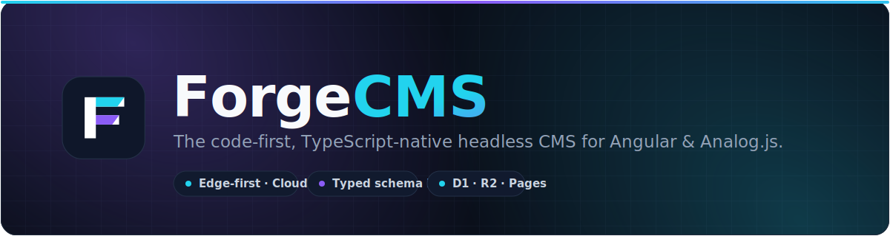
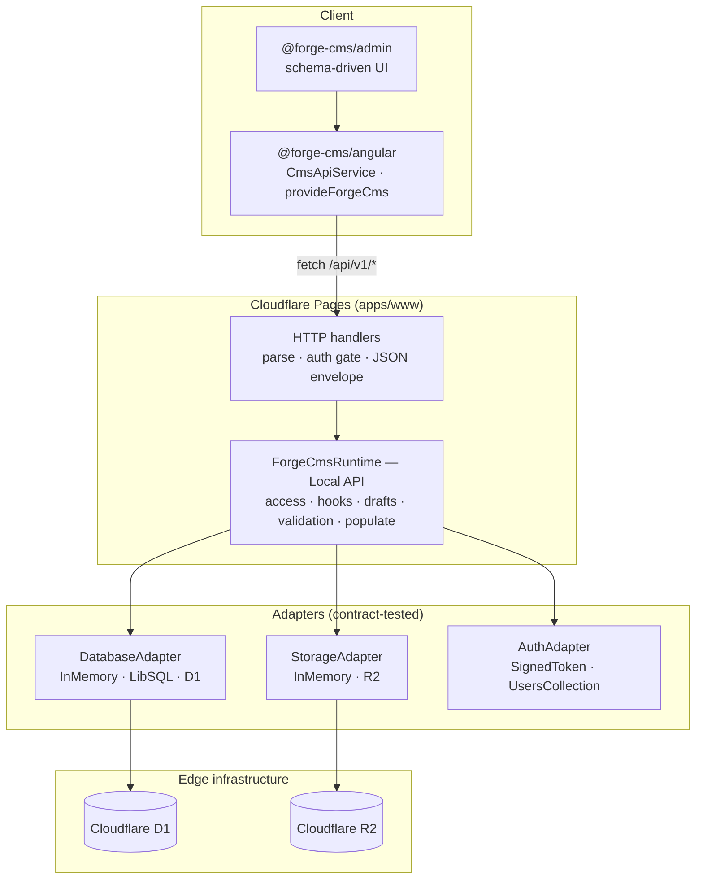

<div align="center">



<br />

**Payload, but for Angular.** A code-first, TypeScript-native headless CMS foundation that runs on the edge — Cloudflare Pages, D1 & R2.

<br />

[](https://github.com/Andersseen/ForgeCMS/actions/workflows/ci.yml)
[](./LICENSE)
[](docs/STATE.md)
[](CONTRIBUTING.md)


**[Live demo](https://forge-cms.pages.dev)** · **[Quick start](docs/QUICKSTART.md)** · **[Architecture](docs/ARCHITECTURE.md)** · **[Roadmap](docs/ROADMAP.md)** · **[Status](docs/STATE.md)**

</div>

---

> [!WARNING]
> **Experimental · pre-alpha · not production-ready** — but substantially implemented, not just scaffolding.
> Nothing is published to npm yet. See [docs/STATE.md](docs/STATE.md) for the continuously-updated, honest picture of what works today.

## What is ForgeCMS?

ForgeCMS is what a [Payload](https://payloadcms.com)-style headless CMS looks like when it's built **Angular-first** and **edge-native** from day one. You describe your content model in TypeScript, and you get a typed CRUD runtime, an admin UI, and an Angular client SDK — all designed to run as a single Cloudflare Pages deployment backed by D1 (SQLite) and R2 (object storage).

No separate database server, no container, no cold Node process. Your schema, your API, and your admin ship together to the edge.

## ✨ Highlights

|                                   |                                                                                                                                                                                                                 |
| --------------------------------- | --------------------------------------------------------------------------------------------------------------------------------------------------------------------------------------------------------------- |
| 🧩 **Code-first schema DSL**      | Define collections and 15 field kinds — including `relation`, `upload`, `richtext`, and composite `group` / `array` / `blocks` — with `defineCollection` / `defineField`, and get full type inference for free. |
| ⚡ **Edge-native runtime**        | One `ForgeCmsRuntime` orchestrator runs the whole pipeline (access → hooks → drafts → validation → relation population) with **zero HTTP involved** — call it directly from server code.                        |
| 🔌 **Adapter-driven**             | Swap databases, storage, and auth without touching business logic. In-memory & LibSQL locally, **Cloudflare D1 + R2** in production — all held to the same contract test suite.                                 |
| 🛡️ **Real auth & access control** | Signed-token auth, a users collection with PBKDF2 hashing, role-based access (admin / editor / viewer), and function-based, row-level access rules.                                                             |
| 🅰️ **Angular client + admin**     | A fetch-based `CmsApiService`, `provideForgeCms`, and schema-driven admin components (list, form, nested composite fields) — the demo `/admin` uses the real package, not a copy.                               |
| ☁️ **One deploy target**          | Builds to a Cloudflare Pages bundle that serves `/api/*` for real (not just static assets), with a single CI pipeline that checks then deploys.                                                                 |

## 📐 The schema DSL

Your content model _is_ TypeScript. Define it once; the types, validation, API, and admin form all follow.

```ts
import { defineCollection, defineField } from '@forge-cms/core';

export const posts = defineCollection({
  slug: 'posts',
  drafts: true, // adds published/draft status + visibility rules
  fields: {
    title: defineField.text({ label: 'Title', required: true }),
    slug: defineField.slug({ label: 'Slug', sourceField: 'title', autoGenerate: true }),
    excerpt: defineField.textarea({ label: 'Excerpt' }),
    body: defineField.richtext({ label: 'Body' }),
    cover: defineField.upload({ label: 'Cover image', collection: 'media' }),
    author: defineField.relation({ label: 'Author', collection: 'users' }),
    tags: defineField.select({ label: 'Tags', options: ['ng', 'edge', 'cms'] }),
    publishedAt: defineField.date({ label: 'Published at', withTime: true })
  }
});
```

Then read and write it through the **Local API** — the same pipeline the HTTP layer uses, minus the HTTP:

```ts
// Trusted server code (an Analog route, a seed script). No fetch, fully typed.
const { docs, totalDocs } = await runtime.find({
  collection: 'posts',
  where: { _status: { eq: 'published' } },
  sort: 'publishedAt',
  order: 'desc',
  depth: 1, // populate the `author` relation with the real record
  limit: 10
});

await runtime.create({ collection: 'posts', data: { title: 'Hello, edge' } });
```

…or over HTTP, with a stable envelope your clients can rely on:

```http
GET  /api/v1/posts?status=published&sort=publishedAt&order=desc&depth=1
POST /api/v1/posts            # validated, auth-protected write
```

## 🏗️ Architecture

A strict, one-directional flow: the client and HTTP layer are thin; all business logic lives in the runtime's Local API; adapters isolate the edge.



See [docs/ARCHITECTURE.md](docs/ARCHITECTURE.md) for the full package graph, data flow, and API contracts.

## 🚀 Quick start

Requires **Node ≥ 22** and **pnpm 10** (`corepack enable`).

```sh
git clone https://github.com/Andersseen/ForgeCMS.git
cd ForgeCMS
pnpm install

# Landing page + /admin demo (real API, in-memory adapters, seed data)
pnpm dev:www

# Or the sandbox for trying the CMS APIs
pnpm dev:playground
```

Open the `/admin` demo and sign in with `demo@forgecms.dev` / `forgecms-demo`.
The **[10-minute walkthrough](docs/QUICKSTART.md)** adds your own collection and exercises the CRUD API with `curl`.

## 📦 Packages

A pnpm-workspaces + Turborepo monorepo. ESM-only, TypeScript strict. None are published to npm yet.

| Package                                        | Version | Description                                                                             |
| ---------------------------------------------- | :-----: | --------------------------------------------------------------------------------------- |
| [`@forge-cms/core`](packages/core)             |  0.1.0  | Schema DSL (`defineCollection` / `defineField`) + runtime validation                    |
| [`@forge-cms/db`](packages/db)                 |  0.1.0  | `DatabaseAdapter` contract + InMemory & LibSQL adapters + SQL schema generator          |
| [`@forge-cms/auth`](packages/auth)             |  0.2.0  | `AuthAdapter` contract + InMemory / external / signed-token / users-collection adapters |
| [`@forge-cms/storage`](packages/storage)       |  0.1.0  | `StorageAdapter` contract + InMemory adapter                                            |
| [`@forge-cms/api`](packages/api)               |  0.1.0  | `ApiContext` / CRUD handler types                                                       |
| [`@forge-cms/runtime`](packages/runtime)       |  0.1.0  | `ForgeCmsRuntime` orchestrator + Local API + framework-agnostic HTTP handlers           |
| [`@forge-cms/cloudflare`](packages/cloudflare) |  0.1.0  | Cloudflare **D1** + **R2** adapters                                                     |
| [`@forge-cms/angular`](packages/angular)       |  0.2.0  | Angular client SDK (`CmsApiService`, `provideForgeCms`)                                 |
| [`@forge-cms/admin`](packages/admin)           |  0.2.0  | Angular admin components (layout, list, schema-driven form)                             |
| [`@forge-cms/testing`](packages/testing)       |  0.1.0  | Shared adapter contract test suites                                                     |

```txt
apps/
  www/          Analog.js landing + /admin demo + h3 server API (/api/v1/*) → Cloudflare Pages
  playground/   Analog.js sandbox for trying the CMS APIs
```

## ☁️ Deployment (Cloudflare only)

ForgeCMS deploys to **one target: Cloudflare Pages**. `apps/www` builds via Nitro's `cloudflare-pages` preset to `apps/www/dist/analog/public` — including `_worker.js`, the compiled API server — so the deployed site serves `/api/*` with real D1 persistence, not just static files.

A **single GitHub Actions pipeline** ([`.github/workflows/ci.yml`](.github/workflows/ci.yml)) runs on every push/PR:

```
checks  →  lint · typecheck · test · build · e2e
   └── deploy (main only)  →  wrangler pages deploy → Cloudflare
```

Deploy manually from your machine at any time:

```sh
pnpm deploy:www   # build:www + wrangler pages deploy
```

**Required repository secrets** (Settings → Secrets → Actions):

| Secret                  | Purpose                                            |
| ----------------------- | -------------------------------------------------- |
| `CLOUDFLARE_API_TOKEN`  | Token with the _Cloudflare Pages: Edit_ permission |
| `CLOUDFLARE_ACCOUNT_ID` | Your Cloudflare account id                         |

D1 binding (`DB`) is configured in [`wrangler.toml`](wrangler.toml); the runtime auto-selects the D1 adapter when `env.DB` is present and falls back to in-memory locally.

## 🧰 Commands

```sh
pnpm dev:www          # landing app + /admin demo
pnpm dev:playground   # playground sandbox
pnpm build            # build all packages and apps (topological, Turbo-cached)
pnpm test             # unit tests (Vitest)
pnpm e2e:www          # Playwright e2e for apps/www
pnpm lint             # ESLint across the repo
pnpm typecheck        # tsc --noEmit across the repo
pnpm format           # Prettier write
pnpm deploy:www       # build + deploy to Cloudflare Pages
pnpm changeset        # add a changeset (required for packages/* changes)
```

**Quality gate:** `pnpm lint && pnpm typecheck && pnpm test && pnpm build`

## 🗺️ Roadmap

Phase 1 — the structural core that separates a typed CRUD layer from a real CMS — is **done**.

- [x] **Phase 0** — D1 auth schema fix, pagination metadata _(publish to npm still open)_
- [x] **Phase 1** — Local API, function-based access control, full hook pipeline, composite fields
- [ ] **Phase 2** — Content model: globals, versions/revisions, localisation, query completeness
- [ ] **Phase 3** — Auth & DX: cookies/refresh/API keys, email adapter, config + plugin system, CLI
- [ ] **Phase 4** — Admin UI: richtext editor, media picker, searchable relation picker, live preview
- [ ] **Phase 5** — The Angular moat: signals-based client resources, an Analog integration package

Full sequencing and rationale in [docs/ROADMAP.md](docs/ROADMAP.md).

## 🤝 Contributing

Non-trivial features start with a spec in [`docs/specs/`](docs/specs) ([SDD workflow](docs/SDD.md)). See [CONTRIBUTING.md](CONTRIBUTING.md) for setup and guidelines, and [CODE_OF_CONDUCT.md](CODE_OF_CONDUCT.md). Changes under `packages/*` require a changeset (`pnpm changeset`).

## 📄 License

[MIT](./LICENSE) © ForgeCMS contributors
