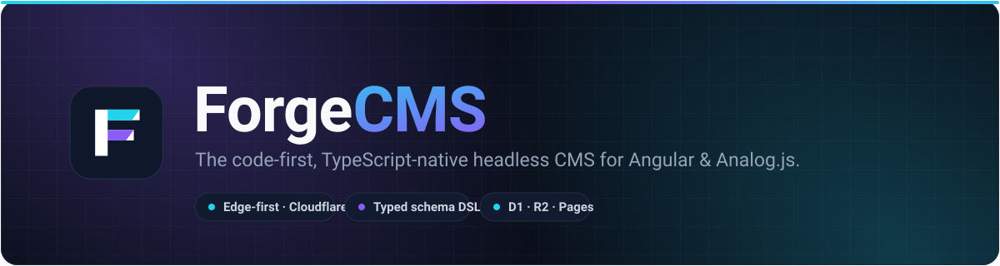

<div align="center">



<br />

**Code-first, TypeScript-native CMS foundation with first-class Angular, Analog, and Cloudflare support.**

<br />

[](https://github.com/Andersseen/ForgeCMS/actions/workflows/ci.yml)
[](./LICENSE)
[](docs/STATE.md)

**[Quick start](docs/QUICKSTART.md)** · **[Architecture](docs/ARCHITECTURE.md)** · **[Roadmap](docs/ROADMAP.md)** · **[Status](docs/STATE.md)**

</div>

---

> [!WARNING]
> ForgeCMS `0.0.1` is an experimental first public release. The fundamentals are usable, but API
> stability is not guaranteed before `1.0`.

## What Is ForgeCMS?

ForgeCMS is a generic CMS foundation for TypeScript applications. You define collections in code,
create a runtime, choose adapters for database/auth/storage, and expose either the Local API or the
framework-agnostic HTTP handlers from your own server.

It is not tied to Analog. The current repository includes Analog apps and Angular packages because
Angular/Analog and Cloudflare are first-class targets, but the core/runtime packages stay framework
agnostic.

## Install

```sh
pnpm add @forge-cms/core @forge-cms/runtime @forge-cms/db @forge-cms/auth @forge-cms/storage
```

Optional integrations:

```sh
pnpm add @forge-cms/cloudflare   # D1 and R2 adapters
pnpm add @forge-cms/angular      # Angular client SDK
pnpm add @forge-cms/admin        # Angular admin components
```

## Minimal Runtime

```ts
import { defineCollection, defineField } from '@forge-cms/core';
import { InMemoryAuthAdapter } from '@forge-cms/auth';
import { InMemoryDatabaseAdapter } from '@forge-cms/db';
import { ForgeCmsRuntime } from '@forge-cms/runtime';
import { InMemoryStorageAdapter } from '@forge-cms/storage';

const notes = defineCollection({
  slug: 'notes',
  fields: {
    title: defineField.text({ required: true }),
    data: defineField.json()
  }
});

const runtime = new ForgeCmsRuntime({
  collections: [notes],
  adapters: {
    database: new InMemoryDatabaseAdapter(),
    auth: new InMemoryAuthAdapter(),
    storage: new InMemoryStorageAdapter()
  }
});

runtime.init();
await runtime.syncSchema();

const created = await runtime.create({
  collection: 'notes',
  data: { title: 'Hello ForgeCMS', data: { source: 'readme' } }
});

const { docs } = await runtime.find({ collection: 'notes' });
```

See [docs/QUICKSTART.md](docs/QUICKSTART.md) for HTTP handler setup, Cloudflare notes, and Angular
usage.

## What `0.0.1` Promises

ForgeCMS `0.0.1` verifies these fundamentals from packed npm artifacts:

- schema definitions with `defineCollection` and `defineField`
- collection CRUD through the Local API
- framework-agnostic HTTP handlers
- runtime validation
- access control and hooks
- relations, JSON fields, and composite fields
- in-memory and LibSQL database adapters
- Cloudflare D1 and R2 adapters at compile level
- storage and auth adapter contracts
- Angular client imports
- admin component imports
- adapter contract tests through `@forge-cms/testing/contracts`

Experimental areas include API stability, large production migrations, deep relation population,
advanced admin workflows, and framework-specific integration packages.

## Packages

All public packages are versioned together for the first release.

| Package                                        | Version | Purpose                                                             |
| ---------------------------------------------- | :-----: | ------------------------------------------------------------------- |
| [`@forge-cms/core`](packages/core)             |  0.0.1  | Schema DSL, collection/global definitions, validation, base types   |
| [`@forge-cms/db`](packages/db)                 |  0.0.1  | Database contract, InMemory and LibSQL adapters, SQL schema helpers |
| [`@forge-cms/auth`](packages/auth)             |  0.0.1  | Auth contract and built-in auth adapters                            |
| [`@forge-cms/storage`](packages/storage)       |  0.0.1  | Storage contract and InMemory adapter                               |
| [`@forge-cms/api`](packages/api)               |  0.0.1  | `ApiContext` and HTTP handler contracts                             |
| [`@forge-cms/runtime`](packages/runtime)       |  0.0.1  | Runtime orchestrator, Local API, HTTP handlers                      |
| [`@forge-cms/cloudflare`](packages/cloudflare) |  0.0.1  | Cloudflare D1 and R2 adapters                                       |
| [`@forge-cms/angular`](packages/angular)       |  0.0.1  | Angular client SDK                                                  |
| [`@forge-cms/admin`](packages/admin)           |  0.0.1  | Angular admin components                                            |
| [`@forge-cms/testing`](packages/testing)       |  0.0.1  | Adapter contract test suites                                        |

## Schema Synchronization

`runtime.syncSchema()` is additive. Built-in SQLite-style adapters create missing tables and add
missing columns, but they do not drop columns, rename columns, change column types, or backfill data.
Treat it as a convenient early schema sync tool, not as a complete migration system.

## Developing This Repository

```sh
git clone https://github.com/Andersseen/ForgeCMS.git
cd ForgeCMS
pnpm install
pnpm build
pnpm dev:www
```

Common commands:

```sh
pnpm lint
pnpm typecheck
pnpm test
pnpm build
pnpm release:verify
pnpm e2e:www
```

Before release, `pnpm release:verify` packs every public package and installs those tarballs into
isolated external consumer projects. This is the publish gate that catches workspace-only mistakes.

## Contributing

Non-trivial changes start with a spec in [docs/specs](docs/specs). See [CLAUDE.md](CLAUDE.md),
[docs/SDD.md](docs/SDD.md), and [CONTRIBUTING.md](CONTRIBUTING.md). Changes under `packages/*`
require a changeset after the first public baseline.

## License

[MIT](./LICENSE) © ForgeCMS contributors
