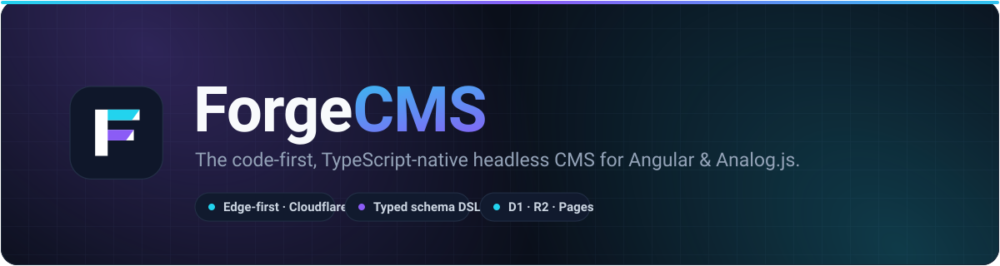

<div align="center">



<br />

**Code-first, TypeScript-native CMS foundation with first-class Angular, Analog, and Cloudflare support.**

<br />

[](https://github.com/Andersseen/ForgeCMS/actions/workflows/ci.yml)
[](./LICENSE)
[](docs/STATE.md)

**[Quick start](docs/QUICKSTART.md)** · **[Architecture](docs/ARCHITECTURE.md)** · **[Roadmap](docs/ROADMAP.md)** · **[Status](docs/STATE.md)**

</div>

---

> [!WARNING]
> ForgeCMS is pre-1.0 (npm `0.7.0`). The fundamentals — schema DSL, Local API, HTTP handlers, access
> control, hooks, drafts, versions, globals, live preview, localization, relations, and a reusable
> Angular admin — are usable and exercised by real consumer apps in this repo, but API stability is
> not guaranteed before `1.0`. See [docs/STATE.md](docs/STATE.md) for exactly what is implemented and
> [docs/ROADMAP.md](docs/ROADMAP.md) for what remains before `1.0`.

## What Is ForgeCMS?

ForgeCMS is a generic CMS foundation for TypeScript applications. You define collections in code,
create a runtime, choose adapters for database/auth/storage, and expose either the Local API or the
framework-agnostic HTTP handlers from your own server.

It is not tied to Analog. The current repository includes Analog apps and Angular packages because
Angular/Analog and Cloudflare are first-class targets, but the core/runtime packages stay framework
agnostic.

## Install

```sh
pnpm add @forge-cms/core @forge-cms/runtime @forge-cms/db @forge-cms/auth @forge-cms/storage
```

Optional integrations:

```sh
pnpm add @forge-cms/cloudflare   # D1 and R2 adapters
pnpm add @forge-cms/angular      # Angular client SDK
pnpm add @forge-cms/admin        # Angular admin components
```

## Minimal Runtime

```ts
import { defineCollection, defineField } from '@forge-cms/core';
import { InMemoryAuthAdapter } from '@forge-cms/auth';
import { InMemoryDatabaseAdapter } from '@forge-cms/db';
import { ForgeCmsRuntime } from '@forge-cms/runtime';
import { InMemoryStorageAdapter } from '@forge-cms/storage';

const notes = defineCollection({
  slug: 'notes',
  fields: {
    title: defineField.text({ required: true }),
    data: defineField.json()
  }
});

const runtime = new ForgeCmsRuntime({
  collections: [notes],
  adapters: {
    database: new InMemoryDatabaseAdapter(),
    auth: new InMemoryAuthAdapter(),
    storage: new InMemoryStorageAdapter()
  }
});

runtime.init();
await runtime.syncSchema();

const created = await runtime.create({
  collection: 'notes',
  data: { title: 'Hello ForgeCMS', data: { source: 'readme' } }
});

const { docs } = await runtime.find({ collection: 'notes' });
```

See [docs/QUICKSTART.md](docs/QUICKSTART.md) for HTTP handler setup, Cloudflare notes, and Angular
usage.

## What ForgeCMS Delivers Today

Verified from packed npm artifacts (`pnpm release:verify`) and real consumer apps in this repo
(`apps/tiny-project`, `apps/demo-aesthetics`, `apps/www`):

- schema definitions with `defineCollection`/`defineField`, including composite fields (group,
  array, blocks) and relations (with `depth: 1` population)
- collection CRUD, `findOne`, nested `and`/`or` queries, and multi-field sort through a Local API
  that infers typed documents from your collection definitions
- framework-agnostic HTTP handlers with a stable response envelope
- runtime validation, the full hook pipeline, and function-based row/field-level access control
- drafts, document versions with restore, live preview, globals, and localization — all enforcing
  the same access/draft/field policy as ordinary reads and writes
- relation integrity (`restrict`/`cascade`/`set-null` on delete), including self-relations
- browser auth (signup/signin/logout/session cookies, CSRF) and machine auth (scoped API keys)
- in-memory, LibSQL, and Cloudflare D1 database adapters (shared contract test suite); R2 storage
- a reusable Angular admin (`@forge-cms/admin`) covering content, users, and auth, embeddable under a
  host app's own routes — not a skeleton, and not a redesign target
- adapter contract tests through `@forge-cms/testing/contracts`

On `main`, not yet in an npm release: schema drift detection (`runtime.planSchema()`, and a
`syncSchema()` that refuses unsafe drift instead of half-applying it) — see
[docs/SCHEMA-UPGRADES.md](docs/SCHEMA-UPGRADES.md).

Not yet delivered pre-1.0: reviewed migration execution and backup/restore (roadmap 0.7 M02/M03), a
portable (S3-compatible) storage adapter, and production SSR for the Angular/Analog client — see
[docs/ROADMAP.md](docs/ROADMAP.md).

Try it: the [Lumea clinic demo](https://forge-cms-demo.pages.dev) (a real site built on the CMS,
source in [`apps/demo-aesthetics`](apps/demo-aesthetics)) and the docs at
[forge-cms.pages.dev](https://forge-cms.pages.dev/docs).

## Versions and roadmap checkpoints

Two separate numbering schemes:

- **npm versions.** The ten public packages are one fixed Changesets group; they always share a
  version. The current release is **`0.7.0`**, which contains everything through roadmap 0.6 (auth
  and data integrity).
- **Roadmap checkpoints** ([docs/ROADMAP.md](docs/ROADMAP.md)) are product guarantees. **0.6 is
  complete. 0.7 (upgrade safety) is in progress:** M01 drift detection is done on `main`, M02
  reviewed migrations is next, M03 backup/restore is pending.

A package version does not certify a roadmap checkpoint: `0.7.0` on npm does not mean roadmap 0.7 is
done.

## Packages

All public packages are versioned together.

| Package                                        | Purpose                                                             |
| ---------------------------------------------- | ------------------------------------------------------------------- |
| [`@forge-cms/core`](packages/core)             | Schema DSL, collection/global definitions, validation, base types   |
| [`@forge-cms/db`](packages/db)                 | Database contract, InMemory and LibSQL adapters, SQL schema helpers |
| [`@forge-cms/auth`](packages/auth)             | Auth contract and built-in auth adapters                            |
| [`@forge-cms/storage`](packages/storage)       | Storage contract and InMemory adapter                               |
| [`@forge-cms/api`](packages/api)               | `ApiContext` and HTTP handler contracts                             |
| [`@forge-cms/runtime`](packages/runtime)       | Runtime orchestrator, Local API, HTTP handlers                      |
| [`@forge-cms/cloudflare`](packages/cloudflare) | Cloudflare D1 and R2 adapters                                       |
| [`@forge-cms/angular`](packages/angular)       | Angular client SDK                                                  |
| [`@forge-cms/admin`](packages/admin)           | Reusable Angular admin components (content, users, auth)            |
| [`@forge-cms/testing`](packages/testing)       | Adapter contract test suites                                        |

They share one version (currently `0.7.0` on npm); see each package's `CHANGELOG.md` for what
changed.

## Schema Synchronization

`runtime.syncSchema()` creates missing tables and adds missing columns; it never drops, renames,
retypes or backfills data. In `0.7.0` that is all it does. On `main` (next release) it first **plans**:
safe additive changes run in one transaction, and anything that needs a data migration throws
`SchemaDriftError` with nothing executed. `runtime.planSchema()` shows the plan without changing
anything. There is no migration runner yet (roadmap 0.7 M02). See
[docs/SCHEMA-UPGRADES.md](docs/SCHEMA-UPGRADES.md).

## Strata

ForgeCMS does not depend on [Strata](https://github.com/Andersseen/Strata). `apps/tiny-project`
installs the published `@strata-sc/core`/`@strata-sc/analog` packages as an external consumer and
serves its two read routes (`GET /api/v1/:collection[/:id]`) through Strata controllers that delegate
to Forge's handlers. Strata owns the transport; Forge owns CMS behaviour. Mutations stay on H3 until
Strata exposes the Web `Request`. Strata Server Components are not used anywhere in this repository.

## Developing This Repository

```sh
git clone https://github.com/Andersseen/ForgeCMS.git
cd ForgeCMS
pnpm install
pnpm build
pnpm dev:www
```

Common commands:

```sh
pnpm lint
pnpm typecheck
pnpm test
pnpm build
pnpm test:cloudflare   # real local D1/R2 via Miniflare — no account or credentials needed
pnpm test:libsql       # real libSQL database, no Cloudflare binding at all
pnpm release:verify
pnpm e2e:www
pnpm e2e:tiny-project
pnpm e2e:demo
```

Before release, `pnpm release:verify` packs every public package and installs those tarballs into
isolated external consumer projects. This is the publish gate that catches workspace-only mistakes.

## Contributing

Non-trivial changes start with a spec in [docs/specs](docs/specs). See [CLAUDE.md](CLAUDE.md),
[docs/SDD.md](docs/SDD.md), and [CONTRIBUTING.md](CONTRIBUTING.md). Changes under `packages/*`
require a changeset after the first public baseline.

## License

[MIT](./LICENSE) © ForgeCMS contributors
